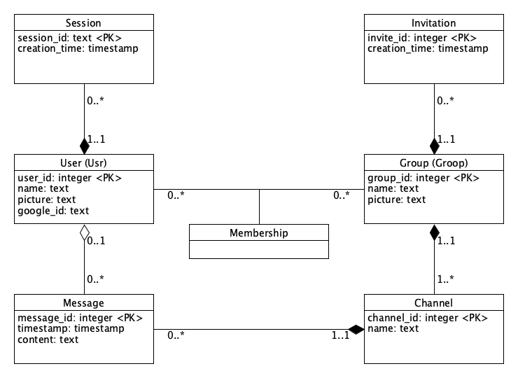

# Not Discord (2021-01-10)

- [Starting](#starting)
- [Planning](#planning)
- [The Missing Pages](#the-missing-pages)
- [The Creation](#the-creation)
- [Problems](#problems)
    - [Signup and Login](#signup-and-login)
    - [WebSockets](#websockets)
    - [Embedded JSON](#embedded-json)
    - [Deleting User Accounts](#deleting-user-accounts)
    - [Deleting Groups and Channels](#deleting-groups-and-channels)
- [Moving Forward](#moving-forward)
    - [Design](#design)
    - [Documenting Progress](#documenting-progress)
    - [Originality](#originality)
- [Wrapping Up](#wrapping-up)

## Starting

It was 2020-11-17 and I was looking ahead at all the free time I had during the
holidays. I didn't want to waste it. I didn't want to spend it playing video
games and watching movies. I decided that I wanted to learn something. A new
language, a new framework, a new technology. For a long time, my learning has
been stagnant. I've been using the same old libraries to make the same old shit.
Learning new things can be painful but it's always worthwhile.

So I started with something that I wanted to learn. That was Rust. I'd never
used it before but I was interested in it. I wanted to start a small project and
work through it to completion. Something with a small scope. Something that
would only take a few weeks. I think I somewhat succeeded. The scope of this
project has grown a bit bigger and taken a little longer than I anticipated but
I'm happy with what I've created.

## Planning

I decided that I wanted to write a web server in Rust. I've worked on servers
before and they can be pretty interesting. I also wanted to use a JavaScript
framework like Vue, React or Angular. So I started designing.

I created a Google Doc and wrote down some ideas. This Google Doc was later
moved into [design_r0.md](./design_r0.md). It took me a few days to figure out
which libraries and frameworks to use. I eventually settled on warp and Vue. At
the same time, I was also working through The Rust Programming Language.

## The Missing Pages

After a few days of planning and working out which libraries/frameworks to use,
I made a start. It was 2020-12-26 when I decided that I wanted to document my
thought process. The first month of the project, where the most important
decisions were made, isn't documented. There are commit messages so the features
implemented during that time can be seen at a glance. Better late than never I
guess!

On 2020-12-26, no only did I want to start writing about my progress, I wanted
to write this report. I saw this project as something to show to potential
employers.

I found that writing down my thoughts during a project can be pretty helpful in
solving problems and working out what I'm going to do. I might do it for more
projects. Even if I'm the only person that reads it, it's still useful to have.
I can look back and perhaps see what I was thinking when I made something work a
certain way. It's a shame that I didn't start this sooner but I'll know for next
time. More about this in [Documenting Progress](#documenting-progress).

## The Creation

I made a simplified version of Discord. When a user first logs in, they're
prompted to either create a group or accept an invitation. Groups are
invite-only. The only way to join a group is to click on an invitation link.

If the user is a member of at least one group, they'll be taken to a channel
page. They'll see the messages of one channel, along with the channels in the
group, the users in the group, and the list of other groups that the user is a
member of. The user can switch channels and switch groups if they like. Groups
can be created, deleted and renamed. Channels can also be created, deleted and
renamed.

An Entity-Relationship diagram probably describes it pretty well. If my
bachelor's degree has taught me anything it's how to make an ER diagram.

## Problems

Some problems and how I solved them, or how I didn't solve them.

### Signup and Login

When a user accesses the site for the first time, they're prompted to login with
their Google account. This is a very streamlined process because the user
doesn't need to add another password to their password manager. However, it's
not so convenient for the server. There's some cryptography and sending things
back and forth between my server and Google that needs to be done. A traditional
signup and login page might have been easier.

Another issue is the validation of names. If I decided to implement `@mentions`,
user names would need to be unique. They might also need to exclude some
characters. This is difficult when the name is coming from Google. It's a
problem that I haven't tried to solve. We would need to somehow transform the
name to make it satisfy the requirements, or give the user an opportunity to
sort it out. This is really easy with a custom signup/login page but not when
using an external service.

### WebSockets

Among the first things that the JavaScript does upon loading is initiating a
WebSocket connection with the server. This socket is used for most client-server
communication. When the user posts a message, there's no need for the server to
hit the database to check their session cookie or determine whether they're
actually a member of the channel they're trying to send a message to. We can do
that once when they connect and never again.

Near the end of the project, I was starting to think that I might have been
overusing the socket. For example, the client can rename a group using the
socket. Creating, deleting and leaving groups is done with a separate HTTP
request. Deleting groups doesn't need the lightning speed of a socket. In fact,
it requires a big database operation so being on a socket won't help. I could
also say that about other things. Deleting channels is done through the socket
and requires an expensive database operation.

The socket messages with "request" in their name should almost certainly be HTTP
requests. The speed boost from the socket is canceled out by the expensive
database operations required. Many of these messages have error responses that
are sent directly back to who requested them. I had to give the errors
categories so that they would go to the right place. Using a HTTP request, the
response would return back to the right place automatically.

By the time I'd realised this, a lot of code had been written and I wasn't keen
on rewriting and refactoring working code. For future projects, I know that the
socket shouldn't be used for everything and sometimes a good old-fashioned HTTP
request is the way to go.

### Embedded JSON

When loading the page for a given channel, that page is going to need the list
of groups that the user is a member of, the list of channels in the group, and
the list of users in the group. So instead of having the browser request this
after the page has finished loading, we could instead embed the data directly
in the HTML. This results in faster loading times because there are fewer
requests. Although, this information still needs to be fetched when the user
changes groups.

### Deleting User Accounts

When a user deletes their account, what happens to their messages? Deleting the
messages seems like the right thing because the author owns them. You could also
say that the recipients own the messages, so when you delete the messages,
you're deleting other users' data. Anonymizing the messages is another option
but some people want every trace of them to be deleted when they delete their
account.

This is not a simple problem. There are legal implications to do with data
privacy to consider as well. I decided not to think about it too hard and do
what Discord does. That is, anonymize messages. Here's a
[Reddit post](https://www.reddit.com/r/discordapp/comments/d90yzq/a_small_rant_on_privacy_issues_disregarding_of/?utm_source=share&utm_medium=web2x&context=3)
that discusses this issue in regards to Discord.

### Deleting Groups and Channels

Any member of a group has the power to delete channels or even delete the group
itself. I don't consider this too much of a problem. Groups are invite-only.
They're meant for a group of friends, or a group of colleagues. People that you
can trust. People that you've probably met in real life. If I ever wanted to
make public groups possible, then I'd have to deal with this.

Discord lets you create public servers that anyone can join, so by necessity, it
has a roles and permissions system to stop random people from coming onto a
server and deleting everything. I don't think this app needs the complexity of
such a thing.

## Moving Forward

A handful of things that I've learnt during this project that could be applied
to future projects.

### Design

Designing is quite possibly the most important step in a project's lifecycle. I
knew that designing was important and I tried to come up with a good design. The
design seemed OK but I was very keen on diving into the code. With this
incomplete design, I was making it up as I went for most of the project. I
didn't really know what I was doing. I rarely referred back to the design
because it wasn't detailed enough to answer the questions I had.

It seems like I ignored the design too. If you look at
[design_r0.md](./design_r0.md), you'll see that it's pretty different from what
was created. [design_r1.md](./design_r1.md) is a description of what I had at
the time. You can hardly call either of those documents designs. They're
summaries of the concepts. The design changed. I think this was because I didn't
spend enough time thinking about it initially. I didn't realise how much work it
would be to have all of those features. I was even thinking "maybe I'll make a
mobile app". I really was clueless.

**Lesson learned:** create a detailed design before getting caught up in "Vue vs
React"

### Documenting Progress

I mentioned this in [The Missing Pages](#the-missing-pages). I found writing
down my thoughts and my progress to be really helpful. For some days, I would
leave a note telling myself what to work on the next day. It was really helpful
to keep me on track and also to tackle some programming problems. I think this
would be called a programming journal. As I've already said, I really regret not
doing it from the start.

I only started taking screenshots at around the same time as starting the
journal. Although, the UI was pretty simple before I started so I'm not missing
much. The biggest changes happened after I started.

Another thing is the task list. I started that list pretty late as well but I
found it really helpful for seeing where I was going and how much there was to
do. Seeing something get ticked off the list is satisfying and can give that
little bit of extra motivation.

**Lesson learned:** write stuff down (in English)

### Originality

There's great benefit in copying an existing product. You can see what you're
working towards, you can look at how they solved certain problems, you can gauge
your progress more accurately. Midway though the project, I realised that I was
copying Discord so I decided to lean into it fully. The list of online/offline
users on the right-hand side of the page exists because Discord has it. It's OK
to solve a problem that's already been solved for the purpose of learning a new
language or framework. If I were to copy something using technologies that I was
very familiar with, there would be no point and I wouldn't get much out of it.

Trying to implement an original idea, an original solution to a problem, in a
new language, using new libraries, probably won't go well. It takes familiarity
with the tools available in order to construct a good solution. If you didn't
know that WebSockets or server-sent events existed then you might never consider
sending live updates from the server. But when you know that you need to send
live updates from the server somehow, you'll stumble upon those two 
technologies.

**Lesson learned:** make something old with something new, make something new
with something old

## Wrapping Up

This has been great. I'm so glad I spent the past two months working on this
rather than movies or video games. While writing this document makes it seem
like the end, I could revisit this project one day. While I'm procrastinating on
something else, I might return to this. I highly doubt that today will be the
last time I touch the code.

While working on this, I tried to implement the least features possible while
still being functional. I believe that I've done that. Of course, this app
doesn't offer anything that isn't available in Discord or Slack (unless you
consider simplicity to be a feature). I hope that my next project will be
something that I'll actually want to use.

I plan on using Rust to make something else. I like making servers so it will
probably be another server. I hinted at this when I talked about
[Originality](#originality).
I'll probably mix in some new stuff too. I was looking at the MDN page on
[Web APIs](https://developer.mozilla.org/en-US/docs/Web/API).
WebRTC could be interesting. Who knows. Maybe I'll implement an original idea...
I haven't decided yet.
